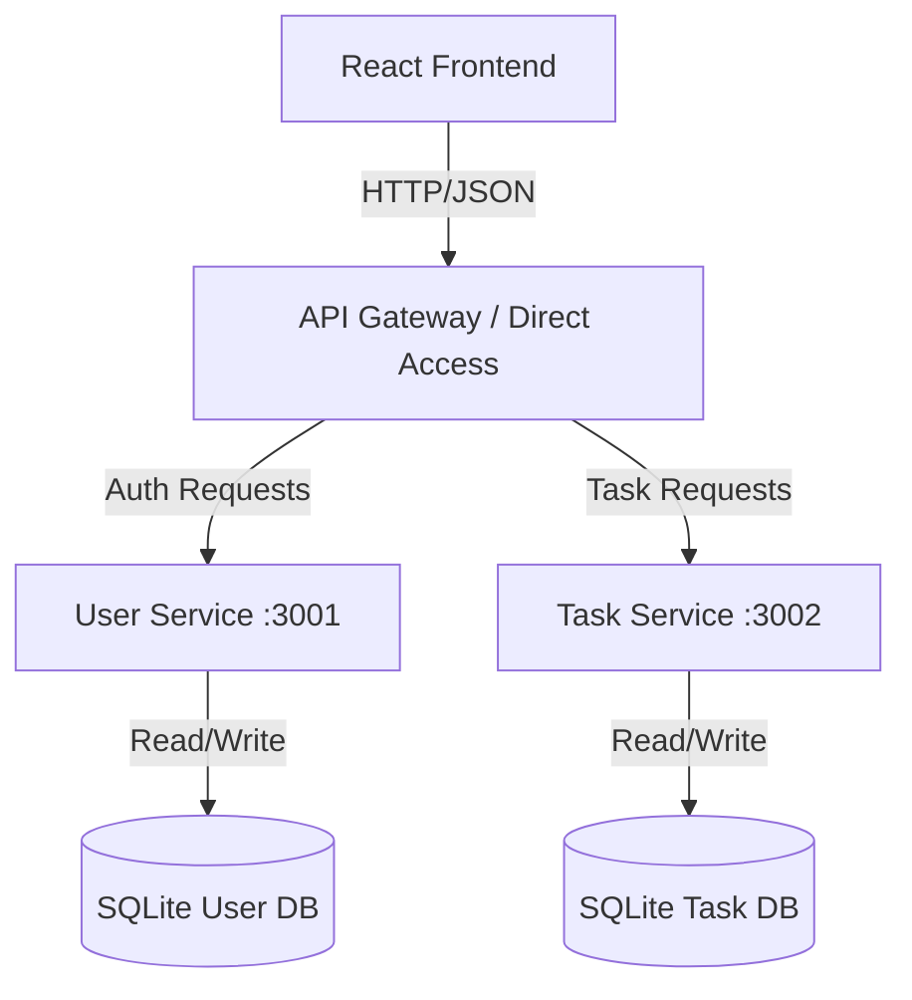

# Microservices Task Manager Application

## Overview

This project is a Proof of Concept (PoC) designed to demonstrate a **Microservices Architecture** for a Task Management System. It is built using **Node.js**, **Express**, and **React**, adhering to software architecture best practices such as **Separation of Concerns (SoC)**, **Controller-Service Pattern**, and **Centralized Error Handling**.

The system consists of three main components:
1.  **User Service**: Manages user registration and authentication (JWT).
2.  **Task Service**: Manages task CRUD operations, decoupled from user logic but integrated via token authentication.
3.  **Frontend**: A modern React application providing a user-friendly interface.

## Architecture

The project follows a modular monolithic structure (monorepo) for ease of development, but each service is designed to be deployed independently.



### Key Architectural Patterns
-   **Controller-Service Pattern**: Business logic is encapsulated in Services, while Controllers handle HTTP request/response lifecycles.
-   **Middleware Chain**: Validation (`Joi`), Authentication (`JWT`), and Error Handling are implemented as reusable middleware.
-   **Structured Logging**: Uses `winston` for production-grade JSON logging.
-   **Input Validation**: Strict request payload validation using `Joi` schemas to prevent malformed data.

## Prerequisites

-   **Node.js**: v18.0.0 or higher
-   **npm**: v9.0.0 or higher

## Installation & Setup

### 1. Clone the Repository
```bash
git clone https://github.com/ramirezjhulian7/Prueba-Tecnica-Aristos.git
cd Prueba-Tecnica-Aristos
```

### 2. User Service Setup
```bash
cd user-service
npm install
cp .env.example .env
# Edit .env if necessary
```

### 3. Task Service Setup
```bash
cd ../task-service
npm install
cp .env.example .env
# Edit .env if necessary
```

### 4. Frontend Setup
```bash
cd ../frontend
npm install
```

## Running the Application

To run the full system locally, you need to start each service in a separate terminal window.

### Terminal 1: User Service
```bash
cd user-service
npm start
# Runs on http://localhost:3001
```

### Terminal 2: Task Service
```bash
cd task-service
npm start
# Runs on http://localhost:3002
```

### Terminal 3: Frontend
```bash
cd frontend
npm run dev
# Runs on http://localhost:5173
```

## API Documentation

### User Service (`:3001`)

| Method | Endpoint | Description | Body |
| :--- | :--- | :--- | :--- |
| `POST` | `/auth/register` | Register a new user | `{ "username": "...", "password": "..." }` |
| `POST` | `/auth/login` | Login and receive JWT | `{ "username": "...", "password": "..." }` |

### Task Service (`:3002`)

*Requires `Authorization: Bearer <token>` header.*

| Method | Endpoint | Description | Body |
| :--- | :--- | :--- | :--- |
| `GET` | `/tasks` | Get all tasks for user | - |
| `POST` | `/tasks` | Create a new task | `{ "title": "...", "description": "...", "status": "..." }` |
| `PUT` | `/tasks/:id` | Update a task | `{ "title": "...", "status": "..." }` |
| `DELETE` | `/tasks/:id` | Delete a task | - |

## Project Structure

```
.
├── user-service/        # Authentication Microservice
│   ├── src/
│   │   ├── controllers/ # Request handlers
│   │   ├── services/    # Business logic
│   │   ├── models/      # Database models
│   │   ├── middleware/  # Auth, Validation, Error handling
│   │   └── utils/       # Logger, helpers
│   └── ...
├── task-service/        # Task Management Microservice
│   ├── src/             # Similar structure to user-service
│   └── ...
└── frontend/            # React Application
    ├── src/
    │   ├── context/     # State management (Auth)
    │   ├── pages/       # Route components
    │   └── components/  # Reusable UI components
    └── ...
```

## Error Handling & Logging

-   **Operational Errors**: Handled gracefully with appropriate HTTP status codes (400, 401, 404, 409).
-   **System Errors**: Caught by a centralized error handler middleware, logged with stack traces (in dev), and returned as generic 500 errors to the client for security.
-   **Logging**: All requests and errors are logged to `combined.log` and `error.log` using Winston.

## Future Improvements (Roadmap)

-   **API Gateway**: Implement an API Gateway (e.g., Nginx or a Node.js proxy) to unify endpoints under a single domain.
-   **Containerization**: Dockerize each service for consistent deployment environments.
-   **Testing**: Add unit tests (Jest) and integration tests (Supertest).
-   **Database**: Migrate from SQLite to PostgreSQL for production scalability.

---
*Generated for Technical Architect Assessment*
